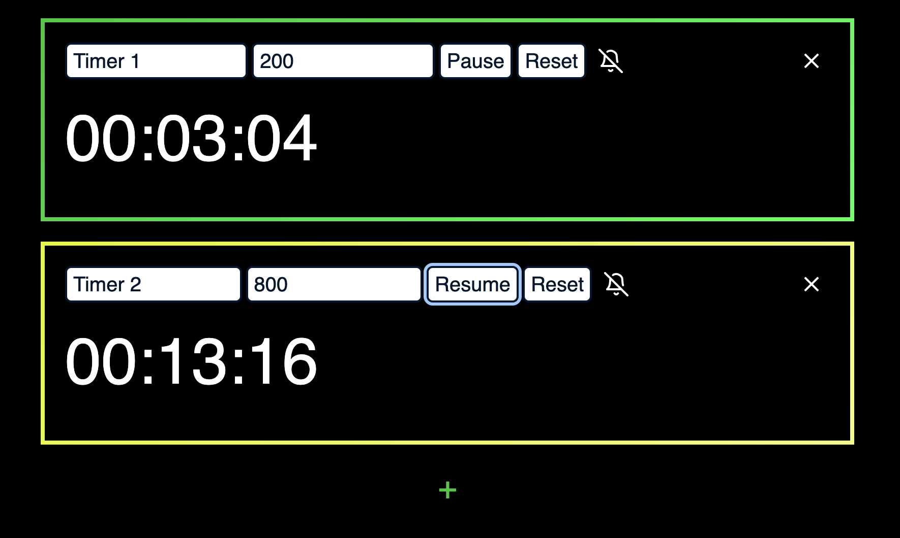

# elm-named-timers
[](https://app.netlify.com/sites/competent-poincare-a107d2/deploys)
___
Try it out [here](https://competent-poincare-a107d2.netlify.app/)

Create multiple timers with names to help keep track. 

___
### Getting Started
```yarn dlx elm-live src/Main.elm --hot -- --output=elm.js```

